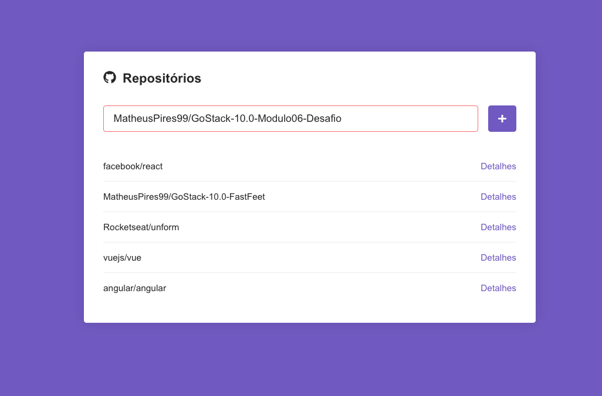

<h1 align="center">
    
</h1>

<h3 align="center">
  Módulo e Desafio 05
</h3>

## :rocket: Primeiro projeto com ReactJS

Nesse projetos desenvolvemos uma aplicação web em ReactJS.

Essa aplicação é um sistema para adicionar repositórios do GitHub e podendo ver os detalhes de tal, tanto quanto as issues abertas e fechadas.

## :hammer: Para criação dessa aplicação utilizamos as seguintes ferramentas:
- Criação de componentes
- Class e function components
- Styled components
- Navegação de rotas
- Estado e imutabilidade
- Propriedades
- Default Props & PropTypes

## :computer: Resultado:

## :memo: Licença

Esse projeto está sob a licença MIT. Veja o arquivo [LICENSE](https://github.com/Rocketseat/bootcamp-gostack-desafio-05/blob/master/LICENSE.md) para mais detalhes.
